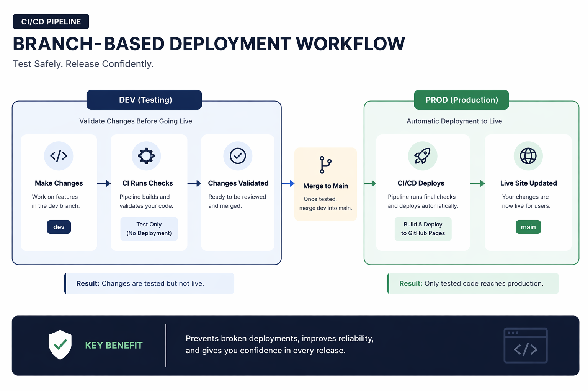

# CDNM Gen3 Data Services Portal

## Overview

This repository contains the implementation of a documentation portal for Gen3 Data Services.
The application provides a structured and user-friendly interface for navigating datasets, workflows, and system capabilities.

The project is designed with a focus on clarity, modularity, and maintainability, while also demonstrating a CI/CD-driven deployment workflow.

---

## Live Application

The application is deployed using GitHub Pages:

**Production URL**
https://harshithayentrapragada.github.io/cdnm/

---

## CI/CD Status


---

## Repository Structure

```
.github/workflows/   CI/CD pipeline configuration (GitHub Actions)
docs/                Architecture diagrams and documentation assets
scripts/             Application logic (JavaScript)
styles/              Styling (CSS)
index.html           Entry point for the application
portal-ui.html       Portal UI layout
README.md            Project documentation
```

---

## CI/CD Architecture



The project uses GitHub Actions to automate deployment:

* Changes pushed to the `main` branch trigger deployment
* GitHub Actions builds and deploys the application
* GitHub Pages serves the latest version

---

## Deployment Workflow

The project follows a branch-based deployment strategy:

* **dev branch**
  Used for development and testing

* **main branch**
  Used for production deployment

### Workflow

```
dev → testing → merge to main → CI/CD pipeline → production deployment
```

---

## Key Features

* Modular frontend structure (HTML, CSS, JavaScript separation)
* Lightweight React rendering via CDN
* Role-based navigation and UI interaction
* CI/CD pipeline using GitHub Actions
* Automated deployment to GitHub Pages

---

## Running Locally

To run the application locally:

1. Clone the repository
2. Open `index.html` in a browser

Alternatively, run a simple static server:

```
npx serve .
```

---

## Future Improvements

* Introduce environment-based deployments (dev vs production)
* Add automated testing in CI/CD pipeline
* Enhance UI/UX for different user roles
* Integrate backend APIs for dynamic data loading

---

## Objective

This project demonstrates:

* CI/CD pipeline implementation using GitHub Actions
* Structured frontend architecture
* Branch-based deployment workflow
* Practical application of software engineering best practices

---
